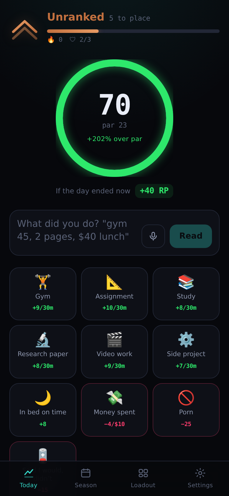

# Ranked Life

Your day gets a score. Beat your own par and you climb the ladder; miss it and
you drop. Miss enough and you get demoted, same as any ranked queue.

Built as a phone-first web app that also works on a laptop or iPad. Local-first,
so it opens instantly and works with no connection, no account and no setup.



---

## Why this one might actually stick

Most habit trackers fail the same way: they ask you to log everything, give you
a number that means nothing, and punish a single missed day by wiping the only
thing you cared about. Every mechanic here is aimed at one of those.

**Rank is the thing you can lose.** Points are just the currency. RP, tiers and
demotion are what make a Tuesday matter. Loss aversion does the work that a
streak counter can't, because a streak only hurts once.

**Par is your own trailing median, not a number someone picked.** It is the
median of your last 14 scored days plus 3%. This is what makes the whole thing
resistant to gaming: inflate your score by farming easy wins and par rises to
meet you, so the inflation buys you exactly nothing. It is also
criterion-referenced, which is the form of negative feedback that doesn't
wreck motivation.

**The thing you dread is worth more than the thing you enjoy.** Every activity
carries a friction rating you set yourself, from ×0.7 to ×1.55. A math
assignment beats an hour on the side project you'd have done anyway. This
doubles as protection against the overjustification effect — paying you for
what you already enjoy is how you stop enjoying it.

**Missing a day damages your streak. It never zeroes it.** The data on habit
formation is clear that one missed day doesn't measurably dent the curve, and
the zero-it-all reset that every app uses is what turns a lapse into quitting.
Here a miss costs 3 days of streak and you carry on.

**Emergency shields.** Three of them, one spent per bad day, earned back every
7 consecutive days. Naming them an emergency reserve is deliberate: you will
hoard them, which is the point. They also only fire on days you genuinely
showed up for, so they can't become a way to skip.

**Crits.** Entries can randomly multiply, on a variable schedule with a pity
timer so droughts don't get long. A reward you can predict stops registering as
a reward; an unpredictable one keeps working.

**You start on the ladder, not at zero.** Bronze III plus five placement days
where you can gain RP but not lose it. A head start measurably raises
follow-through, and the first week being winnable is what builds the
self-efficacy you need in week six.

**Every shortfall comes with the specific fix.** Never "you're 26 points
short", always "26 points short — Assignment 50 min would have covered it".
Criticism only avoids damaging motivation when it carries a correctable
instruction.

**Seasons run 66 days**, which is roughly how long a habit actually takes. At
the end RP compresses toward the middle rather than wiping, and placements
start over.

---

## Logging has to be fast or none of this matters

Three ways in, and the ceiling is two taps:

- **One tap** for done/not-done activities. No dialog, no confirm.
- **Two taps** for anything with an amount — tile, then a preset chip.
- **Say the whole day at once.** Type or dictate `gym 45, two pages of the
  paper, $40 on lunch` and it comes back as a list you confirm. The model
  proposes, you approve; nothing reaches your score without a tap, which is
  what keeps the number trustworthy when it costs you a rank.

You can also backfill yesterday and the day before at 70% credit. Coming back
after a lapse should be worth doing, just never as good as logging on the day.

---

## The gate

The one consequence that reaches outside the app. Set a points threshold and a
site list; until you've banked the points, a browser extension redirects those
sites to a page telling you how far short you are.

It **fails open** by design — any network error, bad response or missing config
leaves the internet working. A blocker that jams shut when a server blinks gets
uninstalled inside a day, and then it protects nothing.

```
GET /api/gate  ->  { locked, score, threshold, remaining, sites, reason }
```

Anything can read that endpoint, so an iOS Shortcut can drive Screen Time off
the same signal.

### Installing the extension

1. In the app: **Settings → The gate → Arm the gate**, set your threshold and
   domains.
2. `chrome://extensions` → enable Developer mode → **Load unpacked** → pick the
   `extension/` folder.
3. Click the extension → Options → paste your app URL and sync key → **Save and
   test**.

It polls once a minute and refreshes immediately when you click the icon.

---

## Running it

```bash
npm install
npm run dev          # http://localhost:3000
```

That is genuinely all it needs. Everything is stored in your browser.

```bash
npm run build && npm start   # production
npm test                     # 57 tests over the scoring and rank engine
npm run typecheck
```

### Deploying

Push to Vercel, or anywhere that runs Next.js. Two things to set if you do:

- `RANKEDLIFE_KEY` — **set this.** Without it the sync and gate endpoints are
  open to anyone who finds the URL.
- `DATABASE_URL` (any Postgres — Neon and Supabase have free tiers) or
  `UPSTASH_REDIS_REST_URL` + `_TOKEN`, if you want your phone, laptop and iPad
  on the same save. Without one of these each device keeps its own copy and
  Settings will honestly say "local only".

Then put the same `RANKEDLIFE_KEY` into **Settings → Sync** on each device.

### Natural-language entry

Set `ANTHROPIC_API_KEY` and it works — it defaults to Haiku 4.5, since this is
a short extraction that runs every time you log a day. To use DeepSeek or any
other OpenAI-compatible endpoint instead, set `RL_AI_PROVIDER=deepseek` plus
`RL_AI_API_KEY`. See `.env.example`.

Without a key the tiles still work; only the text box is disabled.

### Install it to your home screen

It's a PWA. On iOS, Share → Add to Home Screen. That step matters more than it
sounds — this is a twice-a-day app, and a tab is a tab.

---

## How it's put together

```
src/lib/
  types.ts      the whole app state is one JSON document
  scoring.ts    friction weighting, diminishing returns, crits
  par.ts        the trailing-median target and the RP curve
  rank.ts       tiers, divisions, demotion protection, season reset
  engine.ts     day settlement, streaks, shields, penalty box, catch-up
  quests.ts     the daily three
  store.tsx     localStorage-first state with debounced background sync
src/app/api/
  sync/         GET/PUT the whole document, last-write-wins on a rev counter
  gate/         the lock signal
  parse/        natural language -> proposed entries
extension/      MV3 site blocker that reads /api/gate
```

Two invariants worth knowing if you change anything:

**A settled day is frozen.** Score, par and RP are written into a `DayRecord`
and never recomputed. Editing an activity's point value today cannot rewrite
last month's rank.

**Crits are seeded from the entry id.** The roll is fixed the moment the entry
exists, so you can't delete and re-add until it crits.

## Tuning it

Everything is in `src/lib/`, and the constants are named:

| Want | Where |
|---|---|
| Harder or softer RP swings | `rpForDay` in `par.ts` |
| Different tier names or thresholds | `TIERS` in `rank.ts` |
| Longer or shorter seasons | `SEASON_DAYS` in `engine.ts` |
| Crit frequency and size | the `CRIT_*` constants in `scoring.ts` |
| How much a missed day costs | `GHOST_DAY_RP` in `engine.ts` |
| Starter activities | `defaults.ts` |

Run `npm test` after — the suite covers the scoring math, tier boundaries,
demotion protection, shields, placements and the catch-up path.
